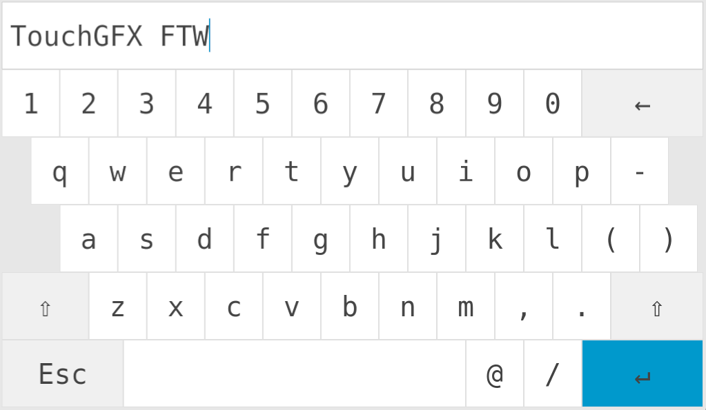
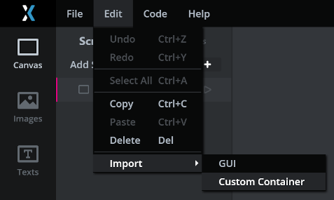
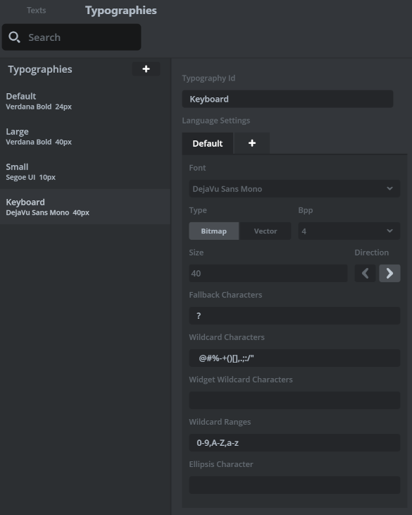
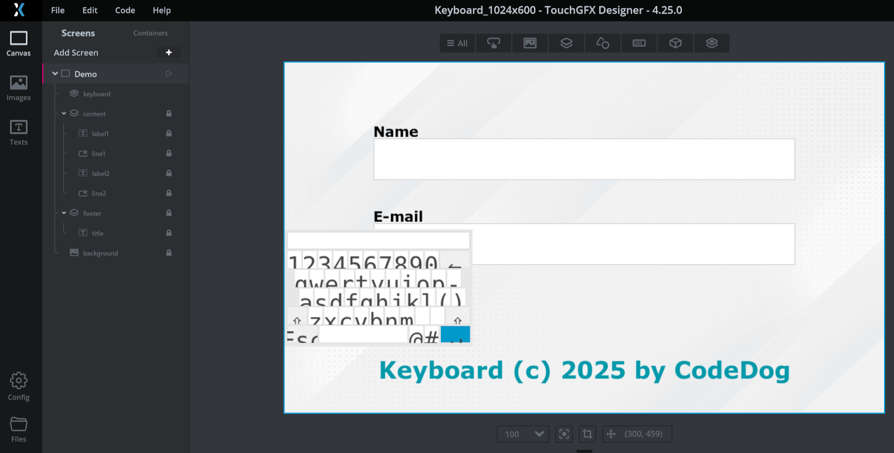
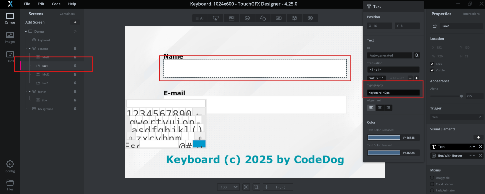
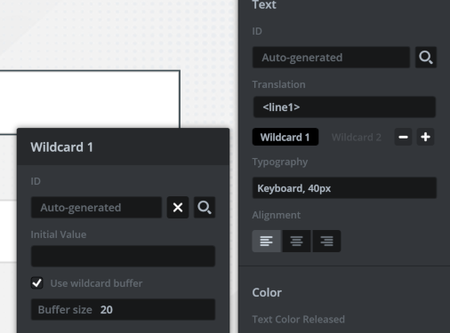
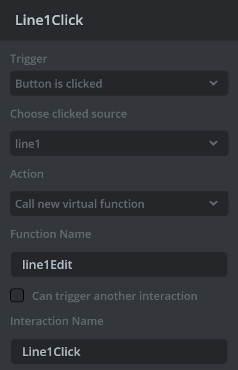
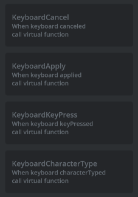

# Keyboard Custom Container

**Author**: Adam Łyskawa  
**Copyright**: ©2025 by [CodeDog](https://codedog.pl)  
**License**: [The MIT License](https://opensource.org/license/mit)

---

## Introduction



The **Keyboard Custom Container** is a reusable TouchGFX component designed
to simplify virtual keyboard integration in embedded GUI applications.
It provides a customizable, touch-friendly keyboard interface.
It's designed to be as simple as it gets and work for any screen resolution.
It doesn't use any bitmaps, it's scalable vector graphics only.
This custom container can be added to any existing TouchGFX project by
either a full stack embedded application developers and graphics designers.
Specialized programming knowledge is necessery only to make the component
interact with the text on the screen or use typed data.
Installing, configuring and setting up doesn't require C++ programming
skills.

## Features

- Any resolution support
  (for resolution smaller than 320x200 it might need some tweaking).

- Customizable colors and layout:

  - Edit the `KeyboardColors.hpp` file to create a custom color scheme.
  - Edit the `KeyboardLayout.hpp` file to create a custom keyboard layout
    scheme, and / or add more special characters support.

    Be aware, that to add more special character support you need to include
    those character in `Keyboard` typography in order for the characters to
    be displayed correctly.

- Super easy integration

  - Load the custom container.
  - Adjust the `Keyboard` typography if needed for custom symbols
    and matching your application font.
  - Place the `Keyboard` container anywhere on your screen, but as a top
    layer, because when it's shown, it should cover anything else. When
    shown the `Keyboard` will be scalled to a full screen size.
  - Wrap the `TextArea`s you want to be editable in `Editable` class.
  - Add `Keyboard` event bindings with `TouchGFX Designer` `Interactions`
    panel.
  - Create event handlers in your code (see example).
  - The `Keyboard` will be shown when the `edit(editable)` method
    is called from a click handler (editable line touched).
  - The edited line will be copied above the virtual keyboard.
  - When the virtual `Enter` key is pressed, the changes will be applied
    to the edited line automatically, optional user actions can be
    added in the view code. The `Keyboard` control will hide.
  - When the virtual `Escape` key is pressed, the changes to the
    edited line will not be applied and the `Keyboard` control will hide.
  - The keyboard can send additional key pressed event that can be bound
    in the `Interactions` panel.
  - One virtual keyboard per screen can edit any number of texts.
  - JUST SEE EXAMPLE TOUCHGFX PROJECTS!

## Installation

- Import the custom container from the `Keyboard.tpkg` file:  
  
- Adjust typography to match your screen resolution and layout:  
  
  Remember to include all special characters used in your layout
  in the `Wildcard Characters` field.
- Optionally edit `KeyboardColors.hpp` and `KeyboardLayout.hpp`
  files to provide custom color scheme and custom layout.

Adjustments and tweaks should probably be done later, after testing
how the keyboard looks in the `TouchGFX Designer Simulator`.

## Integration (AKA recreating the demo)

In order to integrate this custom container in your existing
`TouchGFX` project, follow the similar path as I used to create
the demo, step by step.

1.  Install the component (as described in `Installation` section).
2.  Optionally adjust the `Keyboard` typography, if on your screen the
    `Keyboard` font can look a bit to small or too large.  
    
3.  In `TouchGFX Designer` set up your screen to display your editable lines:  
    
    Go from the bottom to the top, place the `Keyboard` custom container
    at the top. Do not hide it, it's not necessary for it to work, it won't
    be shown unless a text line is edited.
    Place it anywhere on the screen, when used, it will be shown resized
    to the full screen size.
4.  If you want to recreate the demo exactly, name all elements exactly
    like in the demo included with the project, or ones used on the screenshot.
5.  Configure the editable components to use a compatible typography
    that includes all supported wildcard characters. You can even use the
    `Keyboard` typography as it already configured:  
    
    In the demo I used `FlexButton` component as the editable line, as it
    already defines a border, background and the text. It can also change
    appearance when touched which is a nice visual feedback.
    **It is crucial to define 1 wildcard for the text!**.
    Also, the wildcard naturally MUST have a defined buffer for the
    editable text:  
    
    The buffer size will limit the maximal edited text size.
    When a user presses a key when the edited line is at its limit - the key
    press will be ignored.
6.  Configure the interactions for the editable lines:  
      
    For now we just set a call to a virtual function that will be
    created in your screen view base class for you by the `Designer`.
    We will override this function in our code later.
    Repeat steps `5` and `6` for all editable lines.
7.  Add interaction for the `keyboard` component instance events:
    - `keyboard canceled`,
    - `keyboard applied`,
    - `keyboard keyPressed`,
    - `keyboard characterTyped`  
    **The last two events are optional.**  
      

    In the demo example I used the virtual function names as follows:
    - `editCancel`,
    - `editApply`,
    - `keyPressed`,
    - `characterTyped`.

8.  Generate the code for the project.
9.  Use your preferred editor to edit the screen view and presenter code.
10. Edit the screen view class header like this:
    ```cpp
    #pragma once

    #include "gui_generated/demo_screen/DemoViewBase.hpp"
    #include "gui/demo_screen/DemoPresenter.hpp"

    class DemoView final : public DemoViewBase
    {

    public:

        DemoView();
        void line1Edit() override;
        void line2Edit() override;
        void editCancel() override;
        void editApply() override;
        void keyPressed() override;
        void characterTyped(Unicode::UnicodeChar character) override;

    private:

        Editable editable1; // Line1 editable.
        Editable editable2; // Line2 editable.
        char text1[LINE1_SIZE]; // UTF-8 text buffer for line 1.
        char text2[LINE2_SIZE]; // UTF-8 text buffer for line 2.

    };
    ```
    Notice adding `Editable` private members `editable1` and `editable2`.
    They will be needed in order to pass the lines to the `Keyboard` instance.
    We will define their constructors in the implementation file.
    
    The `text1` and `text2` buffers are added only to demonstrate how
    `touchgfx::Unicode` text from editable lines can be converted / copied to
    the simpler `UTF8` text with mostly 8-bit characters.
11. Edit the screen view class implementation file like this:
    ```cpp
    #include "gui/demo_screen/DemoView.hpp"
    #include <iostream>

    DemoView::DemoView()
    :   editable1(Editable(line1, line1Buffer)),
        editable2(Editable(line2, line2Buffer)),
        text1(), text2() { }

    void DemoView::line1Edit()
    {
        keyboard.edit(editable1);
    }

    void DemoView::line2Edit()
    {
        keyboard.edit(editable2);
    }

    void DemoView::editCancel()
    {

    }

    void DemoView::editApply()
    {
        if (keyboard.targets(editable1)) editable1.toUTF8(text1);
        else if (keyboard.targets(editable2)) editable1.toUTF8(text2);
    }

    void DemoView::keyPressed()
    {
        std::cout << "KeyPressed" << std::endl;
    }

    void DemoView::characterTyped(Unicode::UnicodeChar character)
    {
        std::cout << character << std::endl;
    }
    ```
    Notice the only function needed to show the keyboard
    with the line content copied is just `keyboard.edit()`.
    Notice how `keyboard.targets()` which editable line
    triggered the apply event.
    For the demonstration purposes we just copy the `Unicode`
    line bufffers to the corresponding temporary `UTF8` buffers.
    Double check that the buffer sizes are sufficient to fit
    the texts.
    The last 2 methods are used only for debugging with
    Visual Studio and will send the pressed keys to the
    console to test when and how it happens.
    
  That's it. The presenter is not needed for this simple example.
  It can be used however to copy edited lines to a buffer
  that belongs to the application backend.
  
## How it works

The main idea is to draw a keyboard that resembles the
most standard QWERTY layout using default TouchGFX shapes
and text, then make everything scale accordingly at the
runtime.
    
Also at the runtime the accessible symbols can be switched
using the `SHIFT` key.

As this is a special full screen show on demand component,
it's shown in the `Designer` as a mini-keyboard thumbnail,
which is in fact the keyboard scaled to 320x200 resolution.

When its view is initiated, it gets hidden before the first
frame is drawn.

Also, positions and sizes of all keys are calculated to match
the current screen resolution.

When the `edit` method is called, the keyboard copies the
calling `Editable` pointer, also uses its metadata to get
the text buffer and copy the text to it's internal `TextArea`.

The cursor is set at the end of the existing text.

The control is shown full screen and the cursor will blink.

In this very basic version the cursor cannot be moved, but
a backspace key can be pressed to delete existing characters.
Hold the backspace pressed to delete the entire line.

Now when the `Escape` key is pressed the control just hides,
no changes made to the text are preserved.

Also, the `canceled` event will be triggered, that can be bound
in the `Interactions` panel of `TouchGFX Designer` and then
handled with the code.

When the `Enter` key is pressed the changes made to the text
are copied to the original component that is referenced
by the `Editable` instance. Naturally, the element is
automatically invalidated and will redraw with its new
content when the `Keyboard` is hidden / closed.

Also, the `applied` event will be triggered, that can be bound
in the `Interactions` panel of `TouchGFX Designer` and then
handled with the code. It's the place in the code when the
edited text change can be used with the application backend.

For more details please kindly read the inline `Doxygen` documentation
provided in the sources.

The `Keyboard Custom Container` contains those main source files relative to the
project root:

- `gui/include/gui/common/Editable.hpp` - editable class (`Drawable` element wrapper),
- `gui/include/gui/common/KeyboardColors.hpp` - color scheme for the keyboard,
- `gui/include/gui/common/KeyboardLayout.hpp` - default keys layout definition,
- `gui/include/gui/common/KeyboardKey.hpp` - keyboard key class (header only),
- `gui/include/gui/containers/Keyboard.hpp` - keyboard component class header,
- `gui/src/containers/Keyboard.cpp` - keyboard component class implementation.

## Optional tools

The entire code for this custom container and demos was made using
`TouchGFX Designer` and `Microsoft Visual Studio Code`.
As setting up the `VS Code` for the `C++` project might be tricky,
the demos contain my configuration you can tweak to your preferences.

## Modifying the sources

The sources can be modified after the custom container is installed
- in the main project.
To make a package of the modified container it's best to modify
the 1024x600 demo, then export the container as the `.tpkg` file.
This is how this project was made.

## Credits

Developed by Adam Łyskawa for [CodeDog](https://www.codedog.pl).
Content submission for TouchGFX Contest.
